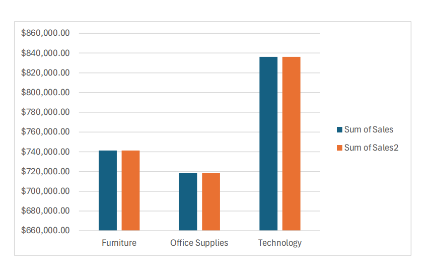
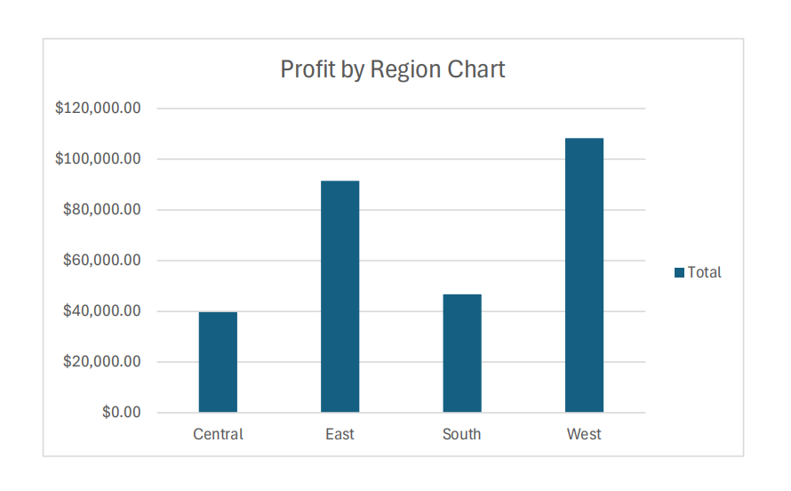
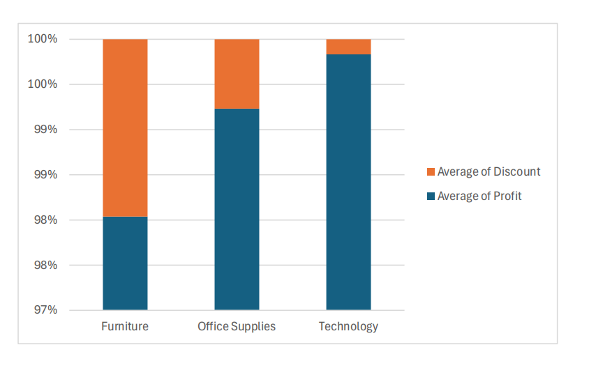

# 📊 Superstore Sales Analysis

---

## 📌 Overview
This project analyzes the Superstore dataset to uncover insights related to **sales, profit, discounts, and customer segments**.

The analysis is performed using **Excel Pivot Tables and Charts**, helping transform raw data into meaningful business insights for decision-making.

> ⚠️ Note: The Excel file contains a representative sample dataset. Pivot Tables and charts are built on this sample, while final insights are based on full dataset analysis.

---

## 🚀 Key Insights
- 📈 Certain product categories consistently generate higher sales and profit  
- 💰 Discounts significantly impact profitability  
- 🌍 Regional differences strongly influence performance  
- 👥 Customer segments contribute differently to total revenue  
- 📊 Some sub-categories outperform others within the same category  

---

## 📊 Analysis Performed

- Sales by Category  
- Sales by Sub-Category  
- Sales by Region  
- Sales by Segment  
- Sales by State  
- Profit by Category  
- Profit by Region  
- Discount vs Profit relationship  

---

## 🧰 Tech Stack
- **Microsoft Excel**
- Pivot Tables  
- Pivot Charts  
- 100% Stacked Column Charts  
- Data Aggregation Techniques  

---

## 📸 Sample Visualizations

### 📊 Sales by Category


### 📊 Profit by Region


### 📉 Discount vs Profit Analysis


---

## 📂 Project Structure

```text id="structure1"
Superstore-Sales-Analysis/
│
├── Superstore.xlsx        # Sample dataset 
├── Superstore_Report.pdf  # Final insights report (full dataset)
├── images/                # Visualization images
└── README.md
```

---

## ⚙️ How to Use
1. Open `Superstore.xlsx` in Microsoft Excel  
2. Explore Pivot Tables and Charts for analysis  
3. Review filters to interact with data views  
4. Read `Superstore_Report.pdf` for final insights  

---

## 🎯 What I Learned
- Creating Pivot Tables for business analysis  
- Building interactive Excel dashboards  
- Understanding sales vs profit relationships  
- Analyzing regional and customer segment performance  
- Interpreting business data for decision-making  

---

## 👤 Author
**Sadikshya Karki**
